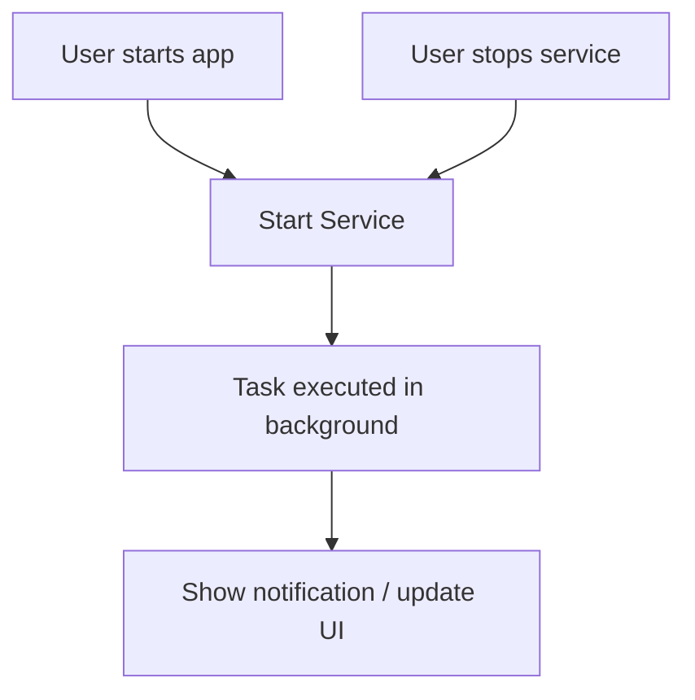

# ServicesApp

A brief description: what this app does, its purpose, and target audience.

---

##  Features

- List of your core features (e.g. background service, UI, notifications, scheduling, etc.)
- E.g. “Long-running service monitoring”, “Foreground / background switch”, “User UI to control service behavior”
- Any permissions required (e.g. `FOREGROUND_SERVICE`, notification permission, etc.)

---

##  Tech Stack

- Language: Kotlin / Java  
- Android APIs: Services, BroadcastReceiver, etc.  
- UI framework: Android Views or Jetpack Compose  
- Build system: Gradle  
- Any libraries you use (e.g. WorkManager, RxJava, etc.)

---

##  Requirements

- Minimum Android API level  
- Device capabilities needed  
- Permissions required  

---

##  Setup & Installation

1. Clone the repository  
   ```bash
   git clone https://github.com/ananya101001/ServicesApp.git
   cd ServicesApp
   ```
2. ## ▶️ Run the App

    1. Open the app on your device  
    2. Start the background service using the provided UI button  
    3. The service runs in the background and updates notifications  
    4. Stop the service via the app UI or system controls

##  Core Implementation (High Level)

- **User launches the app** and starts the service  
- **Service runs in background** to perform tasks (e.g., monitoring, notifications)  
- **UI updates** to reflect service state  
- **Service stops** when user exits or triggers stop action  




